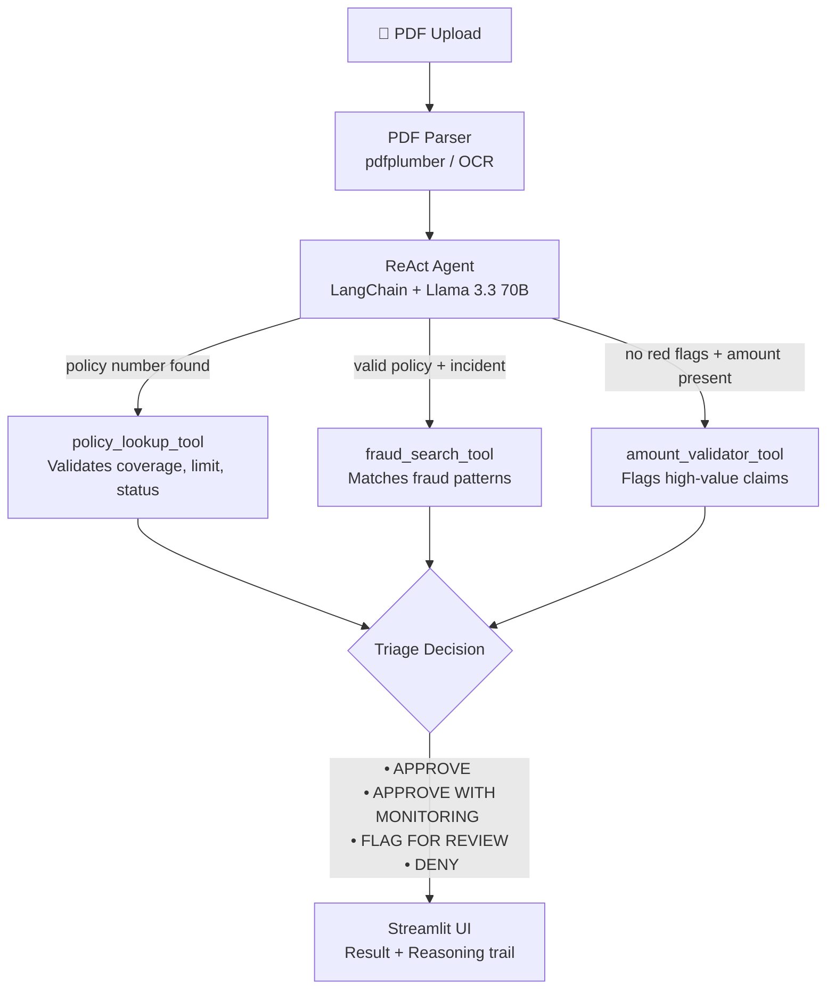

# Claims agent

This repo applies LangChain ReAct agent to act as an intelligent pre-screening layer in insurance claims processing.

Try it live [here](https://claims--agent.streamlit.app/) .

---

### Background
Insurance carriers receive thousands of new claims every day. A large share of intake and early review is still manual or semi‑manual, which makes it slow and expensive. Claim documents arrive in many formats (digital forms, scans of hand-filled forms, emails, free‑text notes, etc.), are often incomplete, and contain unstructured data. Traditional, rule‑based automation struggles with this variability and leads to brittle, error‑prone workflows.

A ReAct agent can sit in front of an existing workflow as an automated pre‑screening layer: it can reason over claim inputs, call tools as needed (and only when needed, preventing unnecessary API calls), and output structured triage suggestion with a reasoning trail. This enriches the information available to manual reviewers and downstream systems, leading to faster decision times. 

### Architecture

