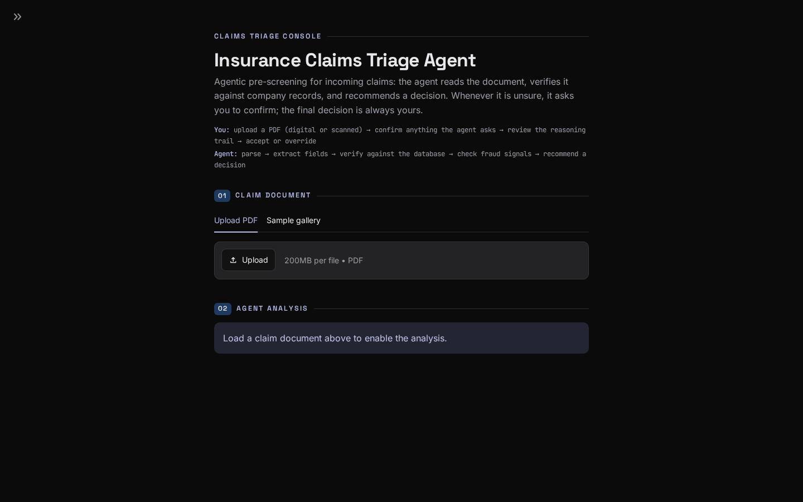
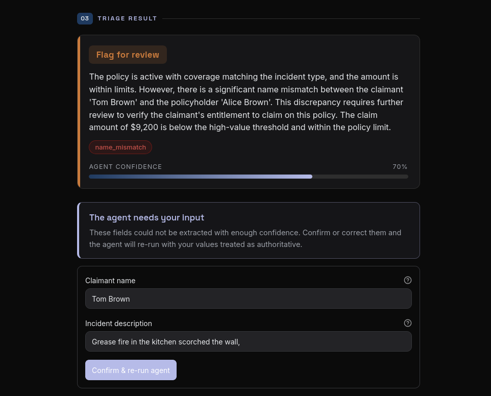
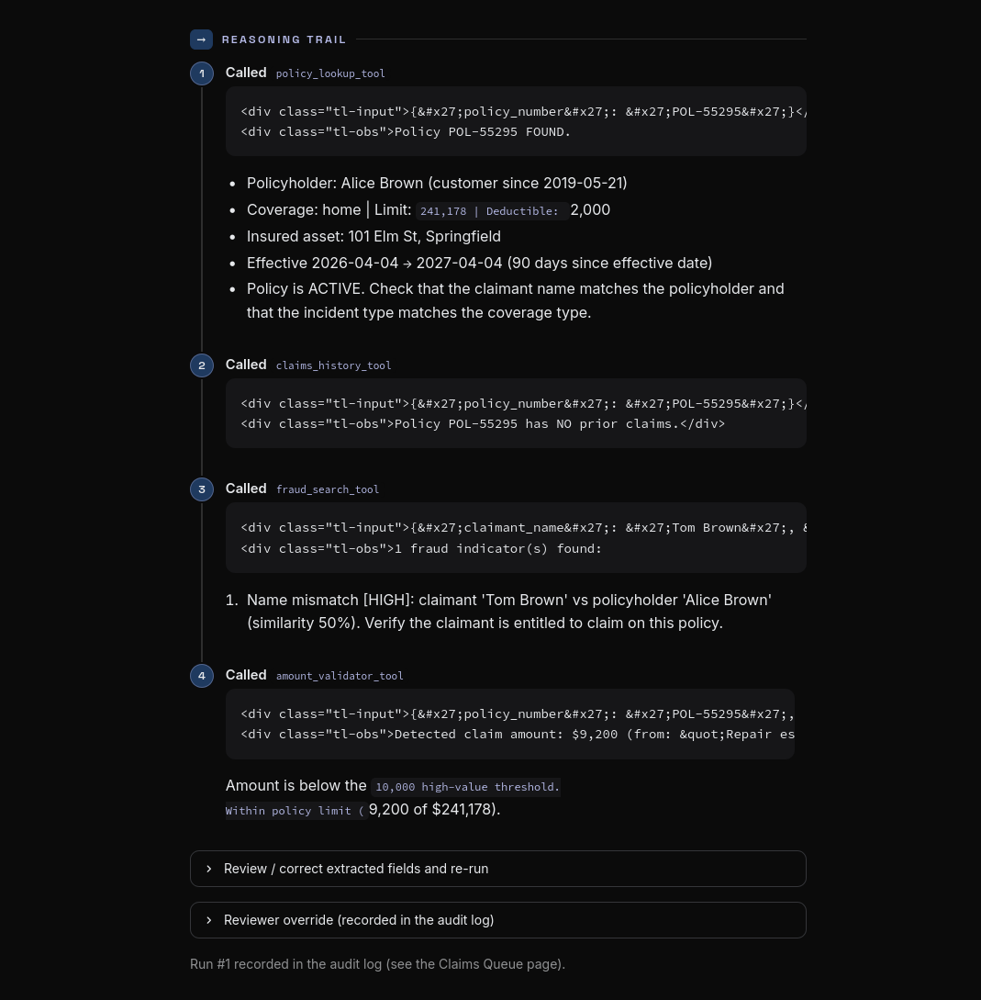
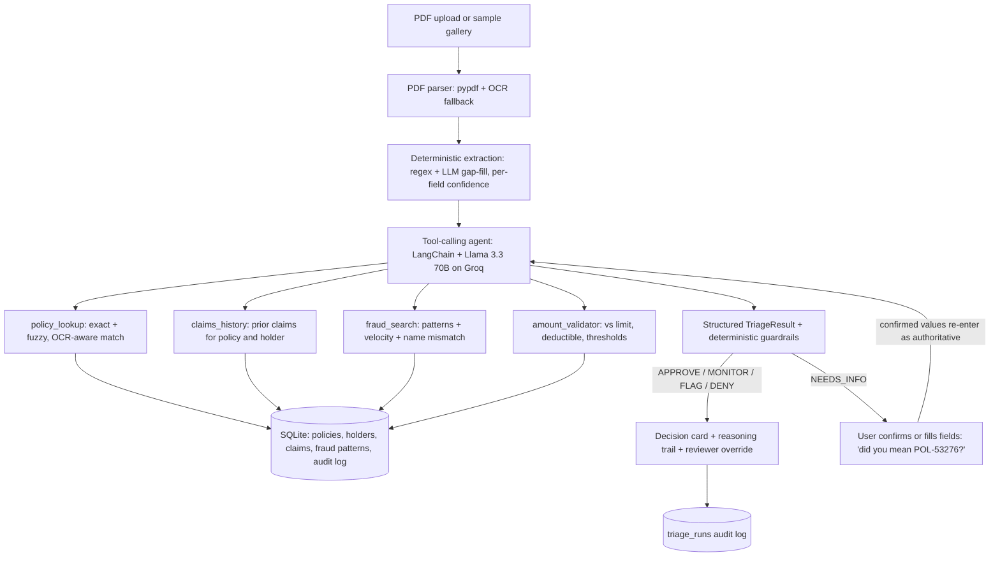
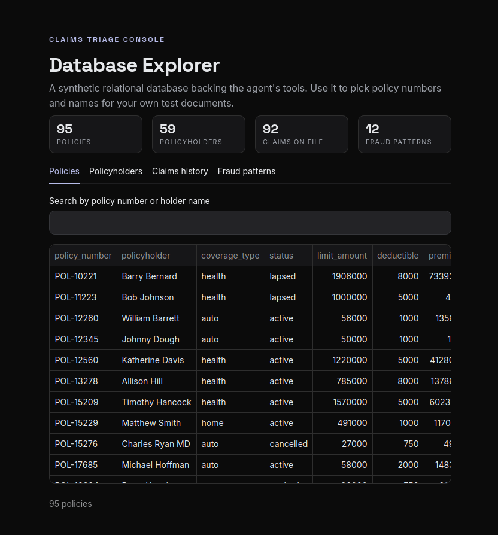

# Claims Agent

**Agentic pre-screening for insurance claims.** 
Upload a claim document and the agent reads it,
checks the details against company records, looks for fraud signals, and recommends a
decision, with a full reasoning trail attached. When it is not sure, it stops and asks you
for clarification instead of guessing. The final call is always yours.

**[Try the live demo](https://claims-agent.streamlit.app/)**

---

### The problem

Insurance carriers take in thousands of new claims a day, and the first pass over them is
still often manual. The documents are messy: digital forms, scans of hand-filled paper,
emails, loose free text. They are often incomplete, and the important details are buried in
unstructured prose. Rule-based automation cracks under that variability, so the tedious job
of reading, cross-checking, and sorting lands on people.

### What this does

This app slots an LLM agent in front of that first pass. Rather than following a rigid
script, it reasons about each claim and reaches for a verification tool only when the data
it needs is actually there, then returns a structured recommendation you can act on. It is
built to assist an adjuster, not replace them: the output is a fast, well-evidenced starting
point, and every run leaves a trail you can inspect.

Two design choices toward trustworthiness:

- **It finds the limits of what it read.** A missing policy number, an OCR-mangled scan, an
  ambiguous name: none of these earn a confident guess. The agent returns `NEEDS_INFO`, the
  UI asks you to confirm or fill the gap, and the run resumes with your input treated as
  authoritative.
- **It doesn't approve what it never verified.** Deterministic guardrails wrap the model, so
  a claim whose policy was never matched in the database can never come back APPROVE. The
  model recommends; the rules keep it honest.

### A claim, end to end

Every recommendation arrives as a structured decision card with a confidence score, the red
flags that fired, and the reasoning behind it. Below, the agent flags a claim because the
claimant name does not match the policyholder, and it asks the reviewer to confirm the two
low-confidence fields before it commits.

The reasoning trail records each tool the agent called and what came
back, so you can see exactly why it landed where it did: the policy lookup, the claims
history, the fraud search, and the amount check against the policy limit.

### Under the hood

Production attributes:

- **A real database, not a JSON stub.** SQLite through SQLAlchemy 2.0 (point `DATABASE_URL`
  at Postgres or MySQL and it moves over), seeded with roughly 60 policyholders, 95 policies,
  90 historical claims, and 12 fraud patterns. The seed includes the awkward cases on
  purpose: expired policies, brand-new customers, repeat claimants, near-limit amounts.
- **Native tool calling.** No brittle `Thought:/Action:` text parsing. The model binds the
  tools directly and only calls one when the relevant field exists.
- **Structured output.** Every result is a Pydantic `TriageResult` (decision, confidence, red
  flags, missing fields, reasoning), backed by the guardrails above rather than free text.
- **Fuzzy, OCR-aware matching.** Common scan confusions like `P0L-S3276` are repaired into
  `POL-53276`, with a "did you mean?" suggestion when the match is close but not certain.
- **A full audit log.** Every run, including the fields, tool calls, decision, your
  corrections, and any reviewer override, is written to `triage_runs` and browsable in the
  Claims Queue.
- **Resilience.** LLM retry with backoff, Groq to OpenAI provider fallback, per-step
  tool-error containment, and an OCR fallback for scanned PDFs.

The Database Explorer page exposes the synthetic records directly, so you can pull real
policy numbers and names to build your own test documents.

