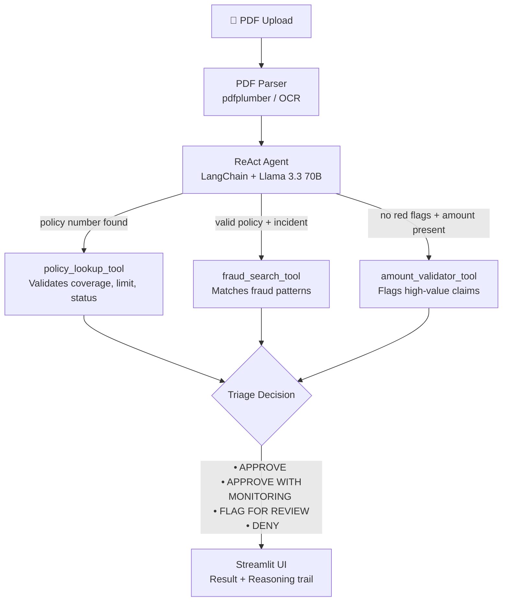

# Claims agent

Try the live demo [here](https://claims--agent.streamlit.app/) .

---

### Architecture

```mermaid
flowchart TD
    A[📄 PDF Upload] --> B[PDF Parser\npdfplumber / OCR]
    B --> C[ReAct Agent\nLangChain + Llama 3.3 70B]

    C -->|policy number found| D[policy_lookup_tool\nValidates coverage, limit, status]
    C -->|valid policy + incident| E[fraud_search_tool\nMatches fraud patterns]
    C -->|no red flags + amount present| F[amount_validator_tool\nFlags high-value claims]

    D --> G{Triage Decision}
    E --> G
    F --> G

    G --> |• APPROVE \n • APPROVE WITH MONITORING \n • FLAG FOR REVIEW \n • DENY| UI[Streamlit UI\n Result + Reasoning trail]
```
